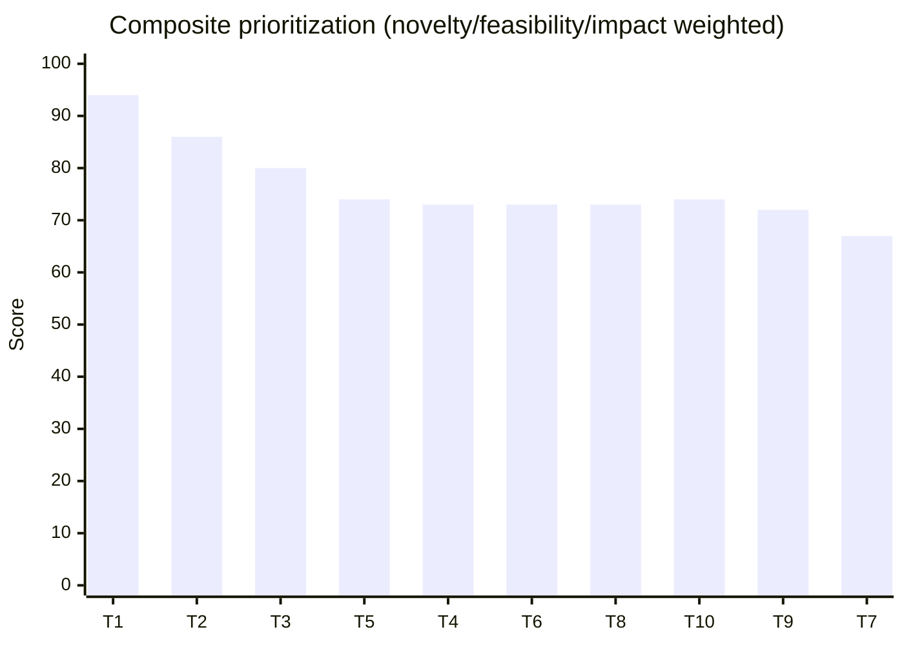

# Dissertation Research Topics Integrating Advanced AI for Airline Techlog Systems

## Executive Summary

Airline technical log (techlog) ecosystems are rapidly becoming “AI-ready” because (a) airlines are migrating from paper technical log pages to Electronic Logbooks/eTech Logs, (b) fleets increasingly generate high-frequency health data via Aircraft Health Monitoring/Management, and (c) modern AI has matured into scalable foundation-model tooling (LLMs, vision foundation models, efficient fine-tuning, and high-throughput inference) that can be adapted to domain workflows with credible governance patterns. citeturn8view0turn12view0turn15search0turn1search4turn1search5turn2search0turn2search2

From an airline operations standpoint, techlog friction remains concentrated in: unreadable/ambiguous free text, missing or inconsistent data, multi-copy “paper circulation delays,” manual re-keying into MRO/CAMO systems, and mismatches between paper truth and partially-digitized feeds (e.g., ACARS snapshots). These issues are explicitly documented in IATA’s Electronic Logbook implementation roadmap and are central targets for AI that combines NLP + conversational interfaces + retrieval, and (where available) multimodal fusion with sensor/ACARS streams and inspection imagery. citeturn8view0turn5search7turn5search18

On the technology side (2021–2026), the most dissertation-relevant advances include: parameter-efficient adaptation (LoRA; QLoRA), retrieval-augmented generation for provenance-aware decision support, instruction-following alignment via RLHF, foundation vision segmentation (SAM) and self-supervised representation learning (MAE), offline/sequential RL formulations (Decision Transformer), and production-grade inference optimization stacks (vLLM; TensorRT-LLM). These advances reduce the barrier to building airline-grade prototypes that are feasible within a 16-week dissertation window while still being analytically rigorous. citeturn1search4turn1search5turn1search6turn3search4turn2search0turn2search5turn1search7turn2search2turn6search24 fileciteturn0file0

This report proposes 10 novel, feasible dissertation topics tailored to airline techlog applications. The strongest “top-3” (balanced novelty–feasibility–impact) are:
1) **Safety-grounded RAG Techlog Copilot** (LLM + retrieval + guardrails + human-in-the-loop),
2) **Multimodal Early Warning for recurring defects** (techlog text + ACARS/sensor features + representation learning),
3) **Offline/Safe DRL for maintenance deferral & dispatch reliability under constraints** (offline RL with simulation + safety constraints). citeturn8view0turn12view0turn5search0turn13view0turn14view0

## Framing the Dissertation in an Airline Techlog Context

A techlog is an aircraft-specific operational record of maintenance status that must be available for operations; in practice it is where flight crew and line maintenance record defects, actions, deferrals, and technical status for dispatch continuity. citeturn7search36turn8view0

IATA’s ELB/eTechLog roadmap clarifies why techlog is a high-leverage AI domain: paper Technical Log Pages (TLPs) are often hard to read (handwriting/language issues), may contain missing/incorrect data that is still certified, and require manual interpretation and back-office re-entry into MRO/CAMO systems—plus manual transfers between logs (e.g., cabin log → technical log). It also highlights systemic mismatch risk when paper remains the “legal record” but partial electronic feeds also exist. citeturn8view0

At the same time, IATA’s Aircraft Health Monitoring/Management white paper frames the operational economics: dispatch delays can cost **$10K+ per hour** and cancellations **$100K+ per event** (operator assertions), pushing airlines toward end-to-end data loops that “Sense–Acquire–Transfer–Analyse–Act.” citeturn12view0

Regulatory-facing constraints matter for dissertation scoping: aviation AI governance is converging on *trustworthiness, human oversight, traceability/logging, and lifecycle assurance*. EASA’s AI Roadmap 2.0 and Concept Paper Issue 2 define Level 1 (“assistance to human”) and Level 2 (“human–AI teaming”) and emphasize learning assurance, explainability, human factors, and safety risk mitigation. citeturn13view0turn17view0turn16view0 In parallel, the EU AI Act codifies requirements such as human oversight expectations and event logging/record-keeping for high-risk systems, which are directly relevant to any techlog AI embedded in operational decision-making. citeturn14view0

**Assumption (explicit):** no proprietary airline dataset is guaranteed available at project start. All topics below therefore specify (a) minimum viable approaches using public datasets/benchmarks and (b) optional “airline uplift” steps if internal techlog/maintenance data access is granted later under governance. citeturn4search4turn4search1turn10search1turn10search4

## Recent Advances Across the Required Course Areas

Modern dissertation feasibility in airline techlog is largely a consequence of several “compressions” in the last five years: compressing *adaptation cost*, *multimodal capability*, *serving latency*, and *governance patterns*.

**Advanced Deep Learning and Deep Neural Networks (foundations → adaptation).** Foundation models became the dominant paradigm: models trained on broad data using self-supervision can be adapted to many downstream tasks, but they introduce inherited risks and governance requirements—a key point emphasized in the Stanford “Foundation Models” report. citeturn15search0 Adaptation has become dramatically cheaper through parameter-efficient fine-tuning (LoRA) and quantized fine-tuning (QLoRA), enabling strong domain specialization within realistic compute budgets (e.g., single-GPU fine-tuning of large models in some settings). citeturn1search4turn1search5

**Conversational AI and NLP applications (RAG, alignment, provenance).** Retrieval-Augmented Generation (RAG) formalized a “parametric + non-parametric memory” approach—retrieving documents during generation—supporting provenance/citations and faster knowledge updates than purely parametric memory. citeturn1search6 Instruction-following and safety alignment improved substantially via RLHF (InstructGPT), producing models preferred by humans over larger baselines in many instruction-following tasks. citeturn3search4 These two advances combine naturally in airline techlog: retrieval provides traceability to manuals, MEL/CDL policy, engineering orders, and historical log context; alignment techniques support safer conversational interfaces. citeturn1search6turn3search4

**Computer Vision (foundation segmentation, self-supervised representations).** Promptable segmentation models such as SAM generalized segmentation at scale and changed the engineering economics of inspection-image workflows by reducing label burden and enabling interactive segmentation. citeturn2search0 Self-supervised representation learning (e.g., MAE) improved transfer learning efficiency in vision, relevant where airline imagery is limited or expensive to annotate (dent/buckle photos, borescope imagery, corrosion imagery). citeturn2search5

**Deep Reinforcement Learning (offline RL, sequence modeling, safety).** Decision Transformer reframed RL as sequence modeling, strengthening offline RL pathways when online exploration is unsafe or impossible—an operational reality for aviation maintenance planning. citeturn1search7 This aligns with airline use cases where historical schedules and deferral decisions exist, but “trial-and-error” in live ops is unacceptable. citeturn1search7turn17view0

**Artificial & Computational Intelligence (knowledge graphs, neuro-symbolic assurance).** Aircraft maintenance is knowledge-heavy (ATA chapters, troubleshooting logic, MEL/CDL constraints, component relationships). Research in aircraft maintenance knowledge graphs demonstrates value in structuring heterogeneous maintenance data and improving decision-making; these approaches increasingly pair deep NLP extraction with symbolic reasoning and rules. citeturn11search16turn11search4 EASA explicitly anticipates hybrid AI (combining AI approaches) under its aviation AI scope. citeturn13view0

**ML system optimization (training + serving).** Production feasibility has improved via optimized serving (vLLM’s PagedAttention, high-throughput batching) and GPU inference optimization stacks (TensorRT-LLM). citeturn2search2turn6search24turn6search0 On the training side, distributed sharding (PyTorch FSDP) and ZeRO-family optimizations continue to reduce memory pressure and scale barriers. citeturn6search2turn6search21

**Trust, safety, and security (aviation governance convergence).** Aviation-specific guidance has become more concrete: EASA Roadmap 2.0 (human-centric, trustworthiness), EASA Concept Paper Issue 2 (learning assurance, explainability, ethics-based assessment, human factors), FAA guidance for Integrated Aircraft Health Management operational authorization (AC 43-218), and cross-sector risk frameworks (NIST AI RMF). citeturn13view0turn17view0turn5search4turn2search3 Security guidance has matured for ML systems: ENISA documents threats (poisoning/evasion/exfiltration), while MITRE ATLAS/Adversarial ML threat matrices provide “tactics and techniques” vocabulary for threat modeling AI deployments. citeturn15search2turn6search7turn6search3

## Airline Techlog Pain Points and Data Assets

### Pain points specific to airline techlog workflows

The IATA ELB/eTechLog roadmap provides a particularly direct, airline-validated problem statement. Key pain points (translated into AI research opportunities) include:

Paper-era friction:
- **Legibility and ambiguity:** handwriting/language issues make entries hard to interpret, increasing downstream errors and time spent by back-office staff. citeturn8view0
- **Data missingness with certification:** incorrect or missing data can still be certified, creating latent compliance and reliability risks. citeturn8view0
- **Latency from multi-copy distribution:** carbon-copy circulation can take days, preventing timely analytics or early interventions. citeturn8view0

Hybrid-digitization friction:
- **Manual re-entry and duplication:** staff re-type “corrected” interpretations into MRO/CAMO systems; information is manually transferred between “cabin log” and “technical log,” etc. citeturn8view0
- **Paper vs. partial electronic mismatch:** ACARS feeds or partial digitization can drift from the “legal record,” creating reconciliation issues and weak data lineage. citeturn8view0turn5search7

Operational economics that amplify techlog value:
- **High cost of technical delays and cancellations:** techlog-driven decisions influence dispatch reliability; IATA reports operator assertions of ~$10K/hour dispatch-delay cost and $100K+ per cancellation event. citeturn12view0

### Available data types (airline + public)

Airline techlog applications typically have access to multiple modalities, though availability varies by operator and fleet. This multi-modality is the core opportunity for “integrated areas” dissertations.

**Structured / semi-structured operational records (commonly internal).**
- Defect entries, rectification actions, deferrals, sign-offs (electronic logbook/eTechLog). citeturn8view0turn7search0
- Operational status fields: aircraft tail, flight leg, station, timestamps, deferred defect list/hold items, line maintenance check completion records (not always digitized initially). citeturn8view0

**Unstructured text streams (internal + public analogues).**
- Free-text defect descriptions and maintainer notes: research shows these contain lead indicators for recurrent defects but are challenging due to jargon/abbreviations and informal language. citeturn7search9turn0search8
- Public analogues for NLP prototyping: NASA ASRS provides sanitized narrative incident reports plus coded fields (not a techlog, but structurally similar for narrative analytics). citeturn4search1

**Health/sensor/ACARS-style telemetry (internal + descriptive sources).**
- ACARS is used for aircraft-ground messaging and can include operational and maintenance-relevant messages; vendors emphasize extraction of value from these messages. citeturn5search7turn5search18
- IATA frames Aircraft Health Monitoring/Management as an end-to-end data pipeline with explicit “Sense–Acquire–Transfer–Analyse–Act” stages. citeturn12view0

**Images/video (internal + partial public).**
- Structural damage photos (dent/buckle), corrosion, component photos; in some airlines, drone inspections are emerging. citeturn9search38
- Engine borescope imagery: academic work exists, but datasets are often proprietary; some limited public-domain image collections and small open sets exist. citeturn7search7turn9search7

**Voice (internal + public adjacent datasets).**
- Voice notes from maintenance or flight crew (where used); ASR advances like Whisper enable strong baseline transcription and customization. citeturn9search12turn9search0
- Public adjacent datasets: air-traffic communications corpora (ATCO2) exist for ASR/NLU (not maintenance, but valuable for “aviation speech domain adaptation” methodology). citeturn9search13

**Regulatory / safety open datasets for benchmarking (public).**
- FAA Service Difficulty Reports (downloadable by year) provide structured descriptions of malfunctions/failures/defects and can anchor public benchmarking for failure taxonomies. citeturn4search4turn4search0
- FAA Airworthiness Directives define enforceable corrective actions for unsafe conditions, useful for retrieval corpora and compliance-aware assistants. citeturn10search6
- NASA prognostics repositories provide time-series degradation datasets (e.g., C-MAPSS) suitable for RUL/anomaly methods when internal engine data is unavailable. citeturn10search1turn10search4

image_group{"layout":"carousel","aspect_ratio":"16:9","query":["airline electronic technical logbook tablet maintenance engineer","aircraft maintenance control center operations room","ACARS message cockpit display","aircraft dent buckle inspection photo"],"num_per_query":1}

### Reference architecture for a techlog AI system

```mermaid
flowchart LR
  A[Techlog entries\n(text + structured fields)] --> D[Ingestion & Data Quality]
  B[ACARS / health messages\n(time series, events)] --> D
  C[Inspection media\n(images/video)] --> D
  D --> E[PII/security controls\nredaction + access policy]
  E --> F[Feature store / embeddings\ntext + time-series + vision]
  F --> G1[NLP models\nclassification, IE, summarization]
  F --> G2[CV models\nsegmentation, detection]
  F --> G3[DRL/optimization\nscheduling, deferral policies]
  G1 --> H[Decision support layer\nranked hypotheses + evidence]
  G2 --> H
  G3 --> H
  H --> I[Conversational UI\nRAG assistant + citations]
  H --> J[Analyst workflows\nreview/approve + feedback]
  J --> K[Continuous learning\nlabels + drift monitoring]
  K --> F
```

This architecture maps directly to IATA’s push for workflow-controlled electronic records (to reduce missingness/ambiguity) and to EASA’s emphasis on “assistance-to-human” systems with explainability and traceability. citeturn8view0turn17view0turn13view0

## Proposed Dissertation Topic Portfolio

The following 10 topics are designed to integrate multiple completed course areas (Advanced Deep Learning; Artificial/Computational Intelligence; Computer Vision; Conversational AI; Deep Neural Networks; Deep RL; NLP; NLP Applications; ML System Optimization), while remaining feasible under a 16-week dissertation model (prototype + analysis + defendable contribution). fileciteturn0file0

### Topic T1: Safety-grounded RAG Techlog Copilot for defect triage, troubleshooting, and deferral support

**Novelty.** Build a *provable-evidence* conversational assistant that answers techlog questions by retrieving and citing authoritative artifacts (MEL/CDL extracts, manuals, engineering orders, prior similar techlogs, FAA/EASA advisories), with explicit “abstain / escalate” logic and audit logging aligned to aviation AI guidance. citeturn1search6turn8view0turn17view0turn14view0

**Research questions / hypotheses.**  
H1: RAG with structured retrieval + safety guardrails reduces hallucination rate and increases task success compared to parametric-only LLM baselines in maintenance QA. citeturn1search6turn15search0  
H2: Domain adaptation via parameter-efficient fine-tuning (LoRA/QLoRA) improves defect-code classification and “next best action” suggestion accuracy without requiring full-model retraining. citeturn1search4turn1search5

**Proposed methods.**  
Model: instruction-following LLM adapted with LoRA/QLoRA; RAG retriever + reranker; tool-form outputs (JSON) for triage actions; safety policy layer (refuse/abstain) and confidence gating. citeturn1search6turn3search4turn1search4turn1search5  
System optimization: vLLM or TensorRT-LLM for low-latency serving; caching for repeated queries; audit-event storage. citeturn2search2turn6search0turn14view0

**Training data needs.**  
Minimum viable (public): FAA SDR + FAA AD text + IATA ELB/AHM documents + curated manuals/handbooks where licensed; construct synthetic QA pairs with SME review. citeturn4search4turn10search6turn8view0turn12view0  
Airline uplift: internal techlog entries + resolutions; MEL/CDL policies; engineering orders.

**Evaluation metrics.**  
Task success rate (SME graded), citation correctness rate, hallucination rate, abstention precision/recall, defect classification F1, retrieval Recall@k / nDCG, latency (p95), and audit completeness (events logged per query). citeturn1search6turn14view0turn17view0

**Expected deliverables.**  
Evidence-grounded chat prototype integrated into a techlog-like UI; benchmark suite of maintenance QA tasks; safety taxonomy (“can answer / must cite / must abstain”); deployment/runbook and risk assessment aligned to EASA trustworthiness concepts. citeturn17view0turn13view0turn2search3

**Estimated effort/complexity.** Medium (high engineering integration, manageable ML).  

**Required resources.** 1–2 GPUs for fine-tuning and embedding; vector DB; SME time for ~200–500 QA evaluations; secure document access controls. citeturn1search5turn14view0

**Potential industry impact.** Faster triage, fewer interpretation errors, better knowledge reuse, and improved traceability (evidence and logs), aligned with regulatory trajectories requiring oversight and record-keeping. citeturn12view0turn14view0turn17view0

### Topic T2: Multimodal Early Warning System for recurring defects using techlog text + ACARS/health signals

**Novelty.** Fuse *unstructured defect narratives* with *telemetry/event streams* to detect emerging recurrent defect patterns earlier than current rule-based monitoring, and generate “lead indicator” alerts with interpretable supporting evidence. citeturn0search8turn12view0turn5search7

**Research questions / hypotheses.**  
H1: Joint text–time-series representations outperform text-only models for predicting recurrence within a fixed horizon (e.g., 7/30/90 days). citeturn0search8turn12view0  
H2: Self-supervised pretraining (contrastive / masked modeling) reduces labeled-data requirements for tail-specific recurring defect prediction. citeturn2search5turn15search0

**Proposed methods.**  
Text: transformer encoder fine-tuned on defect taxonomy classification; abbreviation expansion and domain tokenizer. citeturn7search9turn1search4  
Time-series: event transformer or temporal model over ACARS/health events; late fusion or cross-attention multimodal transformer; uncertainty calibration to support “alert thresholds.” citeturn12view0turn17view0  
Conversational layer: generate “why this alert” explanation with retrieved similar historical cases (mini-RAG). citeturn1search6turn0search8

**Training data needs.**  
Minimum viable: simulate “ACARS-like events” via open prognostics datasets (C-MAPSS) + synthetic mapping to defect categories; techlog-like text via FAA SDR narratives/fields when available. citeturn10search1turn4search4  
Airline uplift: real ACARS/health messages + techlog entries with recurrence labels (repeat defects, repeated deferrals).

**Evaluation metrics.**  
Prediction: AUROC/AUPRC, recall at fixed false-alert rate, time-to-detection gain vs baseline, calibration (ECE/Brier), and operational KPI proxy metrics (prevented repeats, estimated delay-risk reduction). citeturn12view0turn17view0

**Expected deliverables.**  
Multimodal dataset schema + preprocessing pipeline; trained multimodal model; alert dashboard prototype; ablation studies (text-only vs telemetry-only vs fused); “explainable alert packets” for MCC workflows. citeturn12view0turn8view0

**Estimated effort/complexity.** Medium–High (depends on telemetry access; strong research content).  

**Required resources.** 1–2 GPUs; time-series store; SME validation of alert usefulness; moderate annotation (recurrence labels from history). citeturn12view0

**Potential industry impact.** Earlier intervention on emerging recurrent defects, aligning to IATA’s emphasis on proactive AHM and reducing unpredictable events. citeturn12view0turn0search8

### Topic T3: Offline / Safe Deep Reinforcement Learning for maintenance deferral and dispatch reliability under constraints

**Novelty.** Formulate techlog-driven maintenance deferral as a constrained sequential decision problem and learn policies from historical decision traces (offline RL), emphasizing *safety constraints, auditability,* and *counterfactual evaluation* rather than live exploration. citeturn1search7turn17view0turn12view0

**Research questions / hypotheses.**  
H1: Offline RL policies can outperform heuristic deferral rules on simulated or historical replay metrics while respecting hard constraints (MEL/CDL-like). citeturn1search7turn12view0  
H2: Sequence-model RL (Decision Transformer style) reduces sensitivity to reward shaping and supports “what-if” scenario evaluation for maintenance control centers. citeturn1search7turn12view0

**Proposed methods.**  
Environment: build a simulator (tail-day timeline) with stochastic defect arrivals; actions = defer/clear/swap aircraft/route; constraints = allowable deferrals and resource capacity; reward = dispatch reliability proxy – delay/cancellation cost. citeturn12view0turn10search6  
Model: Decision Transformer baseline + constrained policy layer (rule-based shield or penalty methods); offline policy evaluation and stress testing. citeturn1search7turn17view0

**Training data needs.**  
Minimum viable: synthetic environment calibrated using IATA cost figures and public reliability assumptions + FAA SDR frequencies as priors. citeturn12view0turn4search4  
Airline uplift: historical deferral decisions, delay outcomes, and resource constraints.

**Evaluation metrics.**  
Cumulative reward under constraints; constraint violation rate (must be ~0); simulated delay minutes avoided; robustness across stress scenarios; interpretability of policy decisions (feature attribution / rule traces). citeturn17view0turn12view0

**Expected deliverables.**  
Simulator + offline RL training framework; benchmark suite; policy comparison vs heuristics; “human-readable policy explanation” module; governance documentation aligned with EASA trustworthiness and EU logging expectations. citeturn17view0turn14view0turn13view0

**Estimated effort/complexity.** High (strong research depth; careful simulation and evaluation required).  

**Required resources.** Modest GPU/CPU; main cost is design of realistic simulator and SME review to validate constraints and reward realism. citeturn12view0

**Potential industry impact.** High: deferral decisions directly affect dispatch reliability and delay/cancellation costs highlighted by IATA; even small improvements can be economically significant. citeturn12view0

### Topic T4: Neuro-symbolic Maintenance Knowledge Graph from techlogs, manuals, and defect histories

**Novelty.** Combine LLM-based information extraction with an aviation ontology/knowledge graph to support consistent terminology, cross-document reasoning, and compliance-aware recommendations (symbolic rules + neural extraction). citeturn11search16turn11search4turn13view0

**Research questions / hypotheses.**  
H1: Ontology-guided extraction yields higher precision for entity/relation extraction in maintenance text than purely neural extraction. citeturn11search4turn11search16  
H2: Graph reasoning improves troubleshooting recommendation ranking and reduces inconsistent defect categorization across fleets. citeturn11search16turn7search9

**Proposed methods.**  
Build ontology aligned to ATA chapter concepts; extract entities/relations from techlogs and manuals; store in graph DB; apply rule reasoning + graph neural nets for link prediction; expose via conversational RAG over graph + sources. citeturn7search2turn11search16turn1search6

**Training data needs.**  
Minimum viable: FAA SDR + a limited publicly accessible maintenance corpus; ontology seeded from ATA iSpec 2200 descriptions and public structures. citeturn4search4turn7search2  
Airline uplift: internal manuals/work cards + techlog narratives.

**Evaluation metrics.**  
Extraction precision/recall/F1; entity linking accuracy; reasoning accuracy on curated queries; usefulness study with SMEs; coverage and consistency measures. citeturn11search4turn17view0

**Deliverables.**  
Maintenance KG + extraction pipeline; reasoning demo; query interface; reproducible evaluation protocol. citeturn11search16turn7search2

**Complexity.** Medium–High.  
**Resources.** Moderate compute; higher SME input for ontology validation.  
**Impact.** Strong: reduces fragmentation and improves knowledge reuse in the exact “manual interpretation” bottleneck described by IATA. citeturn8view0turn11search16

### Topic T5: Computer Vision for dent/buckle and borescope anomaly detection integrated into techlog auto-reporting

**Novelty.** Use foundation segmentation (SAM) + detection models to convert inspection imagery into structured “damage findings” that auto-populate techlog fields and link to historical damage maps and repair actions. citeturn2search0turn8view0

**Research questions / hypotheses.**  
H1: Promptable segmentation reduces annotation cost while maintaining defect detection performance relative to fully supervised segmentation. citeturn2search0turn2search5  
H2: Joint vision + text (auto-captioning into a controlled vocabulary) reduces reporting time and increases consistency of damage descriptions. citeturn8view0turn17view0

**Methods.**  
Segmentation: SAM-based interactive + fine-tuned segmentation head; Detection: YOLO-style for defect localization; Text: constrained caption generation into ATA-like categories; UI: technician review/accept loop. citeturn2search0turn2search5turn17view0

**Data needs.**  
Minimum viable: open “Aircraft Dent&Crack” small dataset for proof-of-concept plus synthetic augmentation; optional public-domain borescope image sets where available. citeturn9search3turn7search7  
Airline uplift: actual inspection photo workflows and labels.

**Evaluation.**  
mAP for detection; IoU/Dice for segmentation; structured-report completeness and consistency; time-to-report reduction in user study. citeturn17view0turn8view0

**Deliverables.**  
CV pipeline + review UI; dataset curation/annotation guide; integration spec to techlog. citeturn8view0

**Complexity.** Medium.  
**Resources.** Annotation tooling + GPU; SME judgment for labeling standards.  
**Impact.** High: complements digital damage chart workflows and emerging drone inspection practices. citeturn9search38turn8view0

### Topic T6: Voice-to-Techlog assistant (ASR + NLP summarization + structured form filling)

**Novelty.** Convert spoken maintenance findings into structured techlog entries with abbreviations expansion, domain-specific entity extraction, and “confirmation dialogs” to reduce missingness and ambiguity. citeturn9search12turn8view0turn17view0

**Research questions.**  
H1: Domain-adapted ASR reduces WER on maintenance vocabulary and improves downstream entity extraction accuracy. citeturn9search12turn9search13  
H2: Interactive confirmation reduces certified missing-data incidence (a pain point IATA highlights). citeturn8view0turn17view0

**Methods.**  
ASR baseline with Whisper; vocabulary injection; NER + template filling; conversational confirmation; fallback to manual entry. citeturn9search12turn9search0turn17view0

**Data.**  
Minimum viable: synthetic spoken maintenance phrases + aviation corpora methods (ATCO2 as methodology reference). citeturn9search13turn9search12  
Airline uplift: anonymized voice notes + techlog ground truth.

**Evaluation.**  
WER; entity F1; structured-field accuracy; time saved; user satisfaction in a small field trial. citeturn9search12turn17view0

**Deliverables.**  
Voice entry prototype + evaluation report.  
**Complexity.** Medium.  
**Impact.** Medium–High in stations where keyboards are impractical.

### Topic T7: Spares demand forecasting from techlog + RL inventory policy optimization

**Novelty.** Predict part demand (LRUs/consumables) from defect signals and optimize reorder policies with RL under lead times and stockout costs, explicitly targeting AOG and supplier return fees. citeturn12view0turn8view0

**Research questions.**  
H1: Techlog-derived signals improve demand forecasts vs time-only baselines. citeturn0search8  
H2: RL reorder policies reduce expected AOG-related costs under uncertainty compared to classical (s,S) heuristics in simulated supply constraints. citeturn12view0

**Methods.**  
Forecasting model + RL inventory agent; constraints and service-level targets. citeturn1search7turn12view0

**Data/Eval.**  
Primarily simulation + historical parts usage if available; metrics: fill rate, stockout frequency, cost, robustness under disruption scenarios. citeturn12view0

### Topic T8: Fleet-wide recurring defect graphs using GNNs over component networks + texts

**Novelty.** Build a heterogeneous graph (tail ↔ component ↔ defect ↔ station ↔ maintenance action) and use graph neural nets to predict “next recurrence hotspots,” combining structured logs and unstructured narratives. citeturn11search16turn7search9

**Methods.**  
Graph construction; text embeddings as node features; temporal GNN or dynamic graph modeling; explainable subgraph retrieval for maintainers. citeturn11search16turn1search6

**Data.**  
Requires moderate structured history; can prototype with FAA SDR plus synthetic tail mapping. citeturn4search4

### Topic T9: Counterfactual maintenance analytics—estimating the effect of actions on repeat defects and delays

**Novelty.** Use causal inference + representation learning to estimate “what if we had replaced vs deferred,” distinguishing correlation from action effect in techlog histories. citeturn15search0turn17view0

**Methods.**  
Causal graphs with learned representations; counterfactual estimators; sensitivity analyses; integrate with a decision-support UI. citeturn17view0turn2search3

**Data.**  
Harder without internal history (thus lower feasibility), but can be prototyped with simulated causal worlds calibrated to IATA cost structure. citeturn12view0

### Topic T10: ML system optimization & monitoring stack for airline maintenance AI (latency, drift, auditability)

**Novelty.** Treat the dissertation as an end-to-end ML systems optimization study: quantized PEFT fine-tuning + optimized inference + monitoring and audit logging aligned with aviation governance expectations. citeturn1search5turn2search2turn6search0turn14view0turn17view0

**Methods.**  
Serving: vLLM; TensorRT-LLM; caching; latency benchmarks; Monitoring: drift, calibration, abstention; Security threat model using MITRE ATLAS; documentation aligned to NIST AI RMF. citeturn2search2turn6search0turn6search7turn2search3

**Deliverables.**  
Repeatable performance harness; governance/audit report; deployable reference implementation.

## Prioritization, Comparative Table, and Project Plans

### Topic comparison table (relative scores are dissertation-oriented)

Scales: Novelty/Feasibility/Data availability/Impact = 1 (low) to 5 (high). Compute: L/M/H relative.

| ID | Topic (short name) | Key integrated areas | Novelty | Feasibility | Data availability (assumed) | Compute | Impact |
|---|---|---|---:|---:|---:|---|---:|
| T1 | Safety-grounded RAG Techlog Copilot | NLP, Conversational AI, ML systems | 4 | 5 | 5 | M | 5 |
| T2 | Multimodal Early Warning | NLP, DL, time-series, AI systems | 5 | 3 | 3 | M | 5 |
| T3 | Offline/Safe DRL for Deferral & Dispatch | Deep RL, computational intelligence, optimization | 4 | 3 | 3 | M | 5 |
| T4 | Neuro-symbolic Maintenance KG | NLP apps, KGs, reasoning, conversational AI | 4 | 3 | 3 | M | 4 |
| T5 | CV Damage/Borescope → Auto-report | Computer vision, DL, NLP apps | 3 | 4 | 4 | M | 4 |
| T6 | Voice-to-Techlog | Conversational AI, NLP, ASR | 4 | 4 | 3 | M | 3 |
| T7 | Spares Forecast + RL Inventory | NLP signals, forecasting, DRL | 3 | 3 | 3 | M | 4 |
| T8 | Fleet Recurrence GNN | Graph ML, NLP, DL | 4 | 3 | 4 | M | 4 |
| T9 | Counterfactual Maintenance Analytics | Causal AI, DL, computational intelligence | 5 | 2 | 2 | M | 4 |
| T10 | ML Systems Optimization & Monitoring | ML optimization, deployment, governance | 3 | 5 | 4 | L–M | 3 |

### Prioritized ranking with justification

The prioritization below uses a dissertation-weighted composite emphasizing feasibility and impact in airline ops (weights: 0.35 feasibility, 0.35 impact, 0.30 novelty). This weighting is consistent with aviation’s strong “operational usefulness + trustworthiness” bias documented by IATA and EASA. citeturn12view0turn17view0turn13view0

1) **T1 (RAG Techlog Copilot)** — highest feasibility because it can start with public corpora and scales upward with internal data; highest impact because it directly attacks IATA-identified manual interpretation and re-keying pain points while providing traceability aligned to EASA/EU governance. citeturn8view0turn1search6turn17view0turn14view0  
2) **T2 (Multimodal Early Warning)** — highest novelty and strong impact because it operationalizes “lead indicators” in maintainer reports plus health telemetry, aligned with IATA’s AHM roadmap. Feasibility depends on event/telemetry access but can be prototyped via public prognostics data. citeturn0search8turn12view0turn10search1  
3) **T3 (Offline/Safe DRL for Deferral & Dispatch)** — high potential impact given dispatch-delay/cancellation economics; feasible with simulation and offline RL, aligning to aviation’s “no online exploration” constraint. citeturn12view0turn1search7turn17view0  
4) **T5 (CV Auto-reporting)** — strong feasibility where inspection images are available; clear demo value. citeturn2search0turn8view0  
5) **T4 (Neuro-symbolic KG)** — high research depth; feasibility depends on ontology/graph scope control. citeturn11search16turn7search2  
Remaining topics are valuable but either more data-dependent (T8, T9) or more “systems-heavy” (T10) without a single sharp operational KPI unless carefully framed.

### Topic prioritization chart (composite score out of 100)



### One-page project plan for the top 3 topics (16-week dissertation-aligned)

The plans below assume a 16-week dissertation structure with a demo-ready deliverable and analytical rigor expectations. fileciteturn0file0

**Plan for T1: Safety-grounded RAG Techlog Copilot**

Milestones & timeline (weeks):
- Weeks 1–2: Define 30–50 “core techlog questions” with SMEs; build document corpus + access controls; baseline retrieval and citation format. citeturn1search6turn8view0turn14view0  
- Weeks 3–5: Implement RAG pipeline (retriever + reranker + generator); create evaluation harness (hallucination + citation correctness + abstain criteria). citeturn1search6turn17view0turn14view0  
- Weeks 6–8: Domain adaptation with LoRA/QLoRA; add tool-form outputs (triage JSON); integrate optimized serving (vLLM/TensorRT-LLM) and latency benchmarks. citeturn1search4turn1search5turn2search2turn6search0  
- Weeks 9–11: Human-in-the-loop study (SME grading); iterate guardrails (abstain/escalate); add audit logging aligned to EU AI Act “log” expectations. citeturn14view0turn17view0  
- Weeks 12–14: Hardening: security threat model (MITRE ATLAS), red-team prompts, and risk register; document governance. citeturn6search7turn15search2turn2search3  
- Weeks 15–16: Final write-up: ablations, reliability analysis, limitations, and demo packaging.

Key risks & mitigation:
- Hallucinations / unsafe advice → enforce evidence-only answers; abstain-by-default when retrieval confidence low; require citations for all recommendations. citeturn1search6turn17view0  
- Document licensing/access constraints → start with public corpora (FAA AD/SDR/IATA docs) and structure pipeline so internal manuals can be added later. citeturn4search4turn10search6turn8view0  
- Security & prompt injection → adopt threat modeling using MITRE ATLAS and harden retrieval/tool interfaces. citeturn6search7turn6search3

**Plan for T2: Multimodal Early Warning**

Milestones & timeline (weeks):
- Weeks 1–3: Define recurrence targets (repeat defect within N days); design multimodal schema; build synthetic baseline dataset using C-MAPSS + text proxies. citeturn10search1turn0search8  
- Weeks 4–6: Train text-only baseline; train telemetry-only baseline; define alert thresholding and calibration approach. citeturn7search9turn17view0  
- Weeks 7–10: Train multimodal fusion model (late fusion → cross-attention); ablations; uncertainty and calibration. citeturn12view0turn17view0  
- Weeks 11–13: Explainability layer: retrieve similar past cases and show “evidence bundle”; build dashboard. citeturn1search6turn0search8  
- Weeks 14–16: Stress test on distribution shifts; write-up with ablation, failure modes, limitations.

Key risks & mitigation:
- Lack of real ACARS/health data → keep core contribution in multimodal methodology and show transfer plan; demonstrate on C-MAPSS and SDR-like event streams. citeturn10search1turn4search4  
- False alerts → calibrate, set operating points at fixed false-alert budgets, and require human confirmation (Level 1 “assistive”). citeturn17view0turn13view0

**Plan for T3: Offline/Safe DRL for Deferral & Dispatch**

Milestones & timeline (weeks):
- Weeks 1–3: Specify the simulator: state/action/constraints; encode MEL-like deferral rules abstractly; define reward aligned to IATA cost magnitudes. citeturn12view0turn10search6  
- Weeks 4–6: Implement heuristics baseline + evaluation harness; implement Decision Transformer baseline for offline learning. citeturn1search7  
- Weeks 7–10: Add constraint shielding (hard constraint layer) and robustness testing across scenarios (weather/supply disruption). citeturn17view0  
- Weeks 11–13: Offline policy evaluation and interpretability: “why action” explanations, sensitivity analysis. citeturn17view0turn2search3  
- Weeks 14–16: Final benchmarking vs heuristics; write-up and demo.

Key risks & mitigation:
- Simulator realism skepticism → co-design with MCC/engineering SMEs; validate against historical KPI ranges and include sensitivity sweeps to show stability. citeturn12view0  
- Safety constraints complexity → scope constraints to a well-defined subset and enforce them as hard rules (Level 1/2 governance alignment). citeturn17view0turn13view0

## Datasets, Toolkits, and Ethics/Regulation for Airline Deployment

### Public datasets and benchmarks to begin without proprietary access

**Techlog-adjacent text and defect data.**
- entity["organization","Federal Aviation Administration","us aviation regulator"] Service Difficulty Reports downloadable by year (structured defect/failure reports). citeturn4search4turn4search0  
- entity["organization","National Aeronautics and Space Administration","us space agency"] ASRS database online (sanitized narratives + coded fields for retrieval/analysis). citeturn4search1turn4search5  

**Telemetry/prognostics benchmarks (time series).**
- NASA C-MAPSS jet engine simulated data (multivariate time series for RUL/anomaly research). citeturn10search1turn10search4

**Aviation speech datasets (domain adaptation methodology).**
- ATCO2 corpus (large-scale ATC ASR/NLU dataset). citeturn9search13turn9search29

**Aviation vision datasets (limited but usable for PoC).**
- Roboflow “Aircraft Dent&Crack” small open dataset for structural damage PoC. citeturn9search3  
- Drone inspection industry references can support motivation and evaluation framing (e.g., Mainblades case study). citeturn9search38

**Standards and documentation corpora.**
- ATA iSpec 2200 overview (global standard for maintenance/engineering information exchange) via the ATA eBiz standards page. citeturn7search2  
- IATA ELB Implementation Roadmap (techlog digitization) and IATA AHM/AHM Management white paper (sensor-to-action pipeline). citeturn8view0turn12view0

### Recommended toolkits/frameworks (aligned to the course areas)

For modeling and adaptation: LoRA/QLoRA-style PEFT for domain specialization under limited compute. citeturn1search4turn1search5  
For conversational/RAG systems: retrieval-augmented generation principles and evaluation harnesses grounded in the original RAG formulation (dense retrieval + generator). citeturn1search6  
For vision: SAM-style segmentation and MAE-style pretraining to reduce label requirements. citeturn2search0turn2search5  
For offline RL: Decision Transformer-style sequence learning for policies without live exploration. citeturn1search7  
For serving/optimization: vLLM for high-throughput serving, and TensorRT-LLM for optimized deployment on NVIDIA GPUs (important for enterprise latency budgets). citeturn2search2turn6search0turn6search24

### Ethical, regulatory, and deployment considerations for airline operations

**Human-centric operational role (Level 1/Level 2 alignment).** EASA guidance differentiates assistive AI from human–AI teaming systems; dissertation deployments in airline ops should generally remain Level 1 (assistive) unless you can rigorously demonstrate safe oversight, explainability, and failure management. citeturn17view0turn13view0turn16view0

**Auditability and logging.** The EU AI Act emphasizes record-keeping/logging capabilities for high-risk systems and explicitly discusses human oversight mechanisms; even if your system is not formally classified, adopting these controls is prudent in airline safety management environments. citeturn14view0

**Aviation-specific health management governance.** FAA AC 43-218 provides guidance for operational authorization of Integrated Aircraft Health Management Systems; if your dissertation touches AHM/IAHM-style decision support, mapping system outputs to operational authorizations and maintenance program impacts is essential. citeturn5search4turn5search0turn12view0

**Risk management frameworks.** Use entity["organization","National Institute of Standards and Technology","us standards body"] AI RMF 1.0 as a structured lifecycle risk approach (MAP–MEASURE–MANAGE–GOVERN), especially for generative components. citeturn2search3turn2search15

**Security-by-design for ML systems.** ML deployments are vulnerable to poisoning, evasion, extraction, and prompt injection; ENISA documents ML threat landscapes, and entity["organization","MITRE","us nonprofit research org"] ATLAS/Adversarial ML Threat Matrix provides a concrete threat taxonomy for AI systems. citeturn15search2turn6search7turn6search3 For generative AI security hardening, ANSSI’s security recommendations for generative AI systems provide operational guidance patterns. citeturn15search26

**Data protection and workforce considerations.** Techlog data may embed personal identifiers (crew IDs, station staff, signatures), requiring strict access controls, redaction pipelines, and governance (especially if combining voice + text). EASA’s ethics-based assessment theme and NIST RMF both emphasize socio-technical impacts beyond model metrics. citeturn17view0turn2search3

**Deployment constraints unique to techlog.** IATA’s ELB roadmap stresses operational realities: station copy availability, offline/online switching SOPs, device approvals, reliability of data-sharing, and progressive rollout (keep initial scope “replace paper first”). These constraints should be encoded as non-functional requirements for any dissertation prototype to remain operationally credible. citeturn8view0